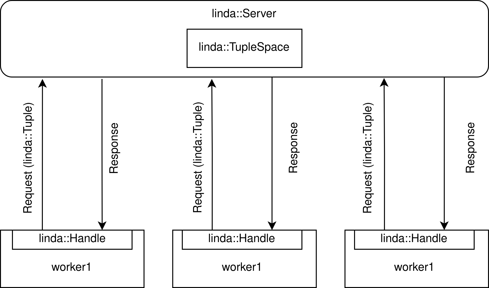
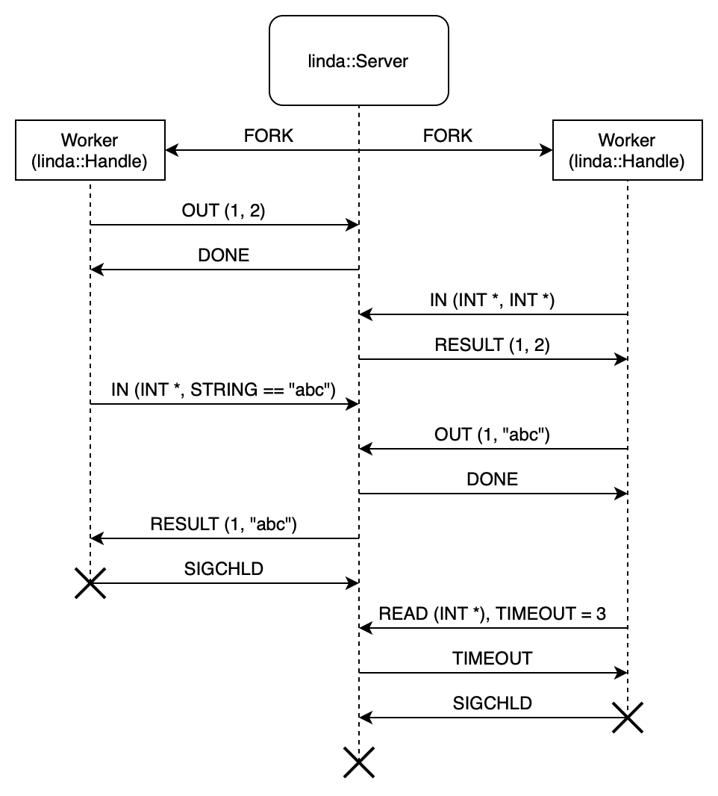

# UXP1A - LINDA - Dokumentacja końcowa

## Skład zespołu
* Świrta Bartosz - lider
* Wojno Maciej
* Górniak Daniel
* Zieliński Jakub

Data przekazania dokumentacji wstępnej: dd.mm.rrrr

## Temat projektu
<p align="justify">
Napisać wieloprocesorowy system realizujący komunikację w języku komunikacyjnym Linda. W uproszczeniu Linda realizuje trzy operacje:
</p> 

* output(krotka)
* input(wzorzec-krotki, timeout)
* read(wzorzec-krotki, timeout)

<p align="justify">
Komunikacja   międzyprocesowa   w   Lindzie   realizowana   jest   poprzez   wspólną   dla   wszystkich   procesów przestrzeń krotek. 
Krotki są arbitralnymi tablicami dowolnej długości składającymi się z elementów 3 typów podstawowych: string, integer, float. 
Przykłady krotek: 
</p>

* (1, ”abc”, 3.1415, ”d”)
* (10, ”abc”, 3.1415) 
* (2,3,1, „Ala ma kota”) 

<p align="justify">
Funkcja output umieszcza krotkę w przestrzeni. Funkcja input pobiera i atomowo usuwa krotkę z przestrzeni, przy czym wybór krotki następuje poprzez dopasowanie wzorca-krotki. Wzorzec jest krotką, w której dowolne składniki mogą być niewyspecyfikowane: * (podany jest tylko typ) lub zadane warunkiem logicznym. Przyjąć warunki: ==, <, <=, > , >= . Przykład: 
</p>

* input(integer:1, string:* , float:* ,string:”d”) – pobierze pierwszą krotkę z przykładu
* input (integer:>0, string:”abc”, float:*) - pobierze drugą krotkę z przykładu

<p align="justify">
Operacja read działa tak samo jak input, lecz nie usuwa krotki z przestrzeni. Operacje read i input zawsze zwracają jedną krotkę (choć pasować może więcej niż jedna). W przypadku gdy wyspecyfikowana krotka nie istnieje operacje read i input zawieszają się do czasu pojawienia się oczekiwanej danej.
</p> 

## Wariant zadania
Realizacja przestrzeni krotek ma zostać wykonana z użyciem potoków nienazwanych z centralnym procesem koordynującym (rodzicem).

## Interpretacja treści i przyjęte założenia
<p align="justify">
Proponowane rozwiązanie to biblioteka pozwalającą na uruchomienie wielu procesów potomnych, działających pod jednym procesem rodzica. Procesy potomne mogą komunikować się ze sobą za pomocą przestrzeni krotek, która jest koordynowana przez proces rodzica. Procesy potomne wykonują operacje zdefiniowane w języku Linda komunikując się z procesem rodzica poprzez potoki nienazwane. Proces rodzica tworzy i ustawia nienazwane potoki do komunikacji przy tworzeniu procesów potomnych. Oznacza to, że proces rodzica po wykonaniu operacji inicjalizacyjnych stanie się serwerem, a procesy potomne klientami.
</p> 

Przyjmujemy następujące założenia:

* Nie zakładamy maksymalnego rozmiaru krotki, jest on ograniczony jedynie przez docelowy system.
* Funkcje, które użytkownik przekazuje do uruchomienia jako pierwsze w procesach potomnych muszą być odpowiedniej postaci:
  patrz [Wymagania funkcji użytkownika](#wymagania-funkcji-użytkownika)

## Opis funkcjonalny
### Ujęcie ogólne
Użytkownikowi biblioteki udostępnione są poniższe funkcjonalności:

* utworzenie instancji obiektu, który realizuje przestrzeń krotek i koordynuje wieloprocesowy dostęp do tej przestrzeni
* uruchomienie systemu komunikacji
* dokonywanie operacji zdefiniowanych przez język Linda:
    * atomowe wstawienie krotki do przestrzeni
    * atomowe odczytanie krotki z przestrzeni
    * atomowe odczytanie i usunięcie krotki z przestrzeni
* zapis informacji o działaniu serwera do logu poprzez wbudowane rozwiązanie (nie jest wymagane żadne działanie ze strony użytkownika)

### linda::Server
<p align="justify">
Biblioteka udostępnia programiście klasę <b><i>linda::Server</i></b>, która to realizuje wieloprocesową komunikację. Przechowuje instancję przestrzeni krotek jako prywatny atrybut i podczas konstrukcji przyjmuje wskazania na funkcje, które zostaną uruchomione jako osobne procesy.
W momencie uruchomienia komunikacji, nastąpi utworzenie procesów potomnych, a następnie proces wywołujący przejdzie w tryb pracy serwera. Korzystając z funkcji <a href="https://man7.org/linux/man-pages/man2/poll.2.html">poll(2)</a>, serwer oczekuje na komunikaty od procesów potomnych i realizuje ich żądania w przestrzeni krotek. 
Klasa udostępnia tylko jedną publiczną metodę:
</p> 

* ```void start()```

<p align="justify">
Metoda ta uruchamia system komunikacyjny. Użytkownik biblioteki może jedynie utworzyć instancję serwera i ją uruchomić.
</p>

### linda::Handle
<p align="justify">
Uchwyt do przestrzeni krotek, implementowany przez klasę, która opakowuje komunikację z procesem koordynującym przy użyciu potoków nienazwanych. Obiekt tej klasy zostanie utworzony
przez <b><i>linda::Server</i></b> i przekazany procesowi potomnemu. Klasa udostępnia trzy metody implementujące instrukcje języka Linda:
</p>

* ```std::optional<Tuple> read(TuplePattern &pattern, int timeout_ms = 0)```
* ```std::optional<Tuple> in(TuplePattern &pattern, int timeout_ms = 0)```
* ```void                 out(Tuple &tuple)```

### Struktury

#### Żądanie\


- rozmiar - rozmiar reszty wiadomości: `int`
- typ - rodzaj żądania: `enum RequestType: char { Read, In, Out }`
- timeout - wartość timeoutu: `int` (dla `Out` ignorowane ponieważ nie czeka na odpowiedź)
- dla `In` oraz `Read` wzorzec krotki: `TuplePattern`, dla `Out` krotka: `Tuple`

#### Odpowiedź\


- rozmiar - rozmiar reszty wiadomości: `int`
- typ - rodzaj odpowiedzi: `enum ResponseType: char { Result, Done, Timeout }`
- dla `Result` dodatkowo krotka: `Tuple`

#### Krotka (Tuple)\


- schemat - schemat krotki zakodowany w stringu znakami `'s'`, `'i'` oraz `'f'` (n.p. `"fsii"` oznacza krotkę `(float, string, int, int)`)
- wartości - wartości krotki w tej samej kolejności co w schemacie

#### Wzorzec krotki (TuplePattern)\


- schemat - schemat krotki zakodowany tak samo jak w krotce
- wzory - wzorce wartości w tej samej kolejności co w schemacie

Wzorce wartości posiadają dwie postacie:

- `Any`
- `{ Eq, Less, LessEq, More, MoreEq }` + wartość

#### Przykład żądania Out\


- rozmiar reszty wiadomości = `1 + 4 + 5 + (4 + 4 + 12 + 4)` = `34`
- rodzaj żądania = `Out` = `'o'`
- timeout = `200ms`
- schemat krotki = `(int, float, string, int)`
- wartości krotki = `(15, 7.0, "hello world", 115)`

#### Przykład żądania Read\


- rozmiar reszty wiadomości = `1 + 4 + 3 + 1 + 12 + 1` = `22`
- rodzaj żądania = `Read` = `'r'`
- timeout = `200`
- schemat krotki = `(string, int)`
- wzorce krotki = `(== "hello world", *)`

#### Przykład odpowiedz Result\


- rozmiar reszty wiadomości = `1 + 4 + 4 + 12 + 4` = `25`
- rodzaj odpowiedzi = `Result` = `r`
- schemat krotki = `(int, string, float)`
- wartości krotki = `(-3, "hello world", 0.34)`

#### Przykład odpowiedzi Timeout\


- rozmiar reszty wiadomości
- rodzaj odpowiedzi = `Timeout` = `'t'`

## Analiza rozwiązania
Poniżej przedstawiamy analizę istonych naszym zdaniem kwiestii proponowanego rozwiązania.

### Realizacja przestrzeni krotek

<p align="justify">
Kontener przechowujący krotki został zrealizowany jako <a href="https://en.cppreference.com/w/cpp/container/unordered_map">std::unordered_map</a>. Pozwala to na optymalizację czasu przeszukiwania struktury w celu 
dopasowania wzorca. Kluczem w strukturze jest schemat krotki (string). Komunikacja z przestrzenią krotek przebiega z udziałem klasy 
<b><i>linda::Handle</i></b>, która opakowuje obsługę potoków udostępniając metody read, in oraz out. Dzięki temu metoda komunikacji 
miedzyprocesowej jest z punktu widzenia użytkownika biblioteki przezroczysta.
</p>

<p align="justify">
Podczas tworzenia obiektu klasy <b><i>linda::Server</i></b>, tworzy on dla każdego klienta odpowiednie potoki nienazwane przez które 
będzie się z nimi komunikował. Następnie za pomocą funkcji <a href="https://man7.org/linux/man-pages/man2/fork.2.html">fork(2)</a> 
tworzy procesy potomne, którym przekazuje wcześniej przygotowane potoki. Po przygotowaniu wszystkich klientów obiekt 
<b><i>linda::Server</i></b> przechodzi w tryb serwera i jest gotowy na obsługę zapytań przychodzących od klientów.
</p>

### Przetwarzanie żądań przez linda::Server
<p align="justify">
Proces koordynujący po uruchomieniu procesów potomnych przechodzi w tryb pracy serwera. Tryb ten realizowany jest poprzez pętlę z warunkiem stopu (zakończenie wszystkich procesów potomnych)
, w której serwer oczekuje na wiadomości od klientów. By wyeliminować aktywne oczekiwanie korzystamy z funkcji <a href="https://man7.org/linux/man-pages/man2/poll.2.html">poll(2)</a>.
Gdy klient wyśle do serwera żądanie ten dokłada je do wewnętrznej kolejki FIFO i rozpoczyna obsługę. 
</p>

<p align="justify">
Obsługa przebiega w pętli, w każdym kroku sprawdzane jest, czy któreś z poprzednich żądań nie uległo przedawnieniu, jeżeli tak to odsyłany jest 
stosowny komunikat do oczekującego klienta (po więcej informacji patrz <a href="#obsluga-timeout'ow">obsługa timeout'ów</a>). Następnie serwer próbuje
wykonać jedno żądanie, iterując się po wewnętrznej kolejce. Wykonanie jednego żądania kończy krok pętli. Warunkiem zakończenia pętli obsługi jest 
niemożność wykonania żadnego z oczekujacych żądań. Jest to przypadek, w którym warunki żadnego z żądań nie zostały spełnione i serwer przechodzi w 
tryb oczekiwania na nowe żądania.
</p>

<p align="justify">
Rozwiązanie to zapewnia, że procesy nie zostaną zagłodzone - kolejność realizacji żądań ustalana jest na podstawie kolejności zgłoszeń. 
Dodatkowo eliminujemy aktywne oczekiwanie i optymalizujemy działanie timeout'ów, o czym szerzej w kolejnej sekcji.
</p>

<a id="obsluga-timeout'ow">
</a>

### Obsługa timeout'ów
<p align="justify">
Timeout realizowany jest przez serwer, przez wysłanie do klienta odpowiedzi, że nie zdążył on na czas zrealizować żądanie. Timeout 
podawany jest w milisekundach i jest on synchronizowany do serwera - tzn. timeout liczony jest od czasu zarejestrowania przez serwer 
żądania klienta. Oznacza to, że z punktu widzenia użytkownika próba wykonania operacji może zablokować proces na dłużej niż podana 
wartość, ale gwarantuje poprawną synchronizację żądań.
</p>

<p align="justify">
W celu zapewnienia możliwie małej niedokładności, przed każdą próbą wykonania kolejnego żądania sprawdzane jest które żądania się przedawiniły i do nich priorytetowo wysyłany jest komunikat o przedawnieniu żądania.
</p>

<p align="justify">
Uważamy, że takie podjście jest odpowiednie, gdyż gwarantujemy poprawność synchronizacji i tym samym nie dojdzie do sytuacji w której 
klient odblokował się po timeout'cie, ale serwer zaczął już wykonywać operację input - efektywnie błędnie usuwająć krotkę z przestrzeni. 
Jedynym sposobem na zapewnienie poprawnego działania systemu jest poprawna synchronizacja klienta z serwerem, która w tej sytuacji 
wymusza, żeby to serwer informował klienta o tym, że żądanie się przedawniło i żądana operacja nie zostanie wykonana. Biorąc pod uwagę, że 
systomowe funkcje takie jak  <a href="https://man7.org/linux/man-pages/man2/nanosleep.2.html">nanosleep(2)</a> również nie gwarantują 
pełnej dokładności czasowej, uważamy brak takiej gwarancji w naszej bibliotece za dopuszczalny. 
</p>

## Podział na moduły
* LindaServer - realizuje koordynatora przestrzeni krotek. Tworzy przestrzeń krotek i uruchamia procesy, które chcą z niej korzystać. Implementuje serwer obsługujący żądania wykonywania operacji języka Linda wysyłane przez utworzone procesy.
* LindaHandle - realizuje obiekt dostępowy do przestrzeni krotek. Obiekt ten posiada interfejs języka Linda i jest wykorzystywany przez procesy korzystające z przestrzeni krotek. Implementuje operacje języka Linda przez wysyłanie żądań do koordynatora przestrzeni krotek.
* LindaTuple - zawiera implementacje struktur reprezentujących krotki i wzorce krotek, oraz operacje pozwalające na ich serializację i deserializację.
* LindaTupleSpace - realizuje przestrzeń krotek. Posiada metody modyfikujące przestrzeń odpowiadające operacjom języka Linda.
* Moduł testowy - zawiera testy jednostkowe i przykładowe programy korzystające z biblioteki.

## Struktura komunikacji między modułami\


## Przykładowa sesja systemu\


## Zawartość repozytorium

Projekt składa się dwóch części: biblioteki implementującej serwer, oraz przykładowych programów wraz z testami.

Część pierwsza znajduje się w folderach include oraz src, zawierają one odpowiednio pliki nagłówkowe oraz pliki źródłowe.

Druga część projektu znajduje się w folderze examples. Znajduje się tam kilka prostych przykładów użycia biblioteki oraz testy akceptacyjne. Testy jednostkowe znajdują się w folderze test.

## Budowanie projektu
W celu zbudowania biblioteki należy wywołać w terminalu:
```
mkdir cmake-build
cd cmake-build
cmake ..
cmake --build .
cd ..
```
Biblioteka zostanie zbudowana w folderze **lib** jako biblioteka współdzielona *.so*.

W celu zbudowania przykładów należy ustawić flagę **BUILD_EXAMPLES** w **CMakeLists.txt** na wartość **True**.
```
set(BUILD_EXAMPLES True)
```
W celu zbudowania testów jednostkowych należy ustawić flagę **BUILD_TESTS** w **CMakeLists.txt** na wartość **True**.
```
set(BUILD_EXAMPLES True)
```
Następnie wywołać w terminalu:
```
cmake --build ./cmake-build
```
Programy wykonywalne zostną zbudowane w folderze **bin**.

## Interfejs użytkownika

System udostępniany jest użytkownikowi w formie biblioteki. Zawiera ona klasę serwera <i>Linda</i>, która pozwala na uruchomienie systemu. Aby uruchomić system użytkownik musi podać listę funkcji realizujących procesy potomne. Funkcje te mają dostęp do przestrzeni krotek poprzez przekazywany im obiekt typu `linda::Handle`. Uruchomienie systemu powoduje utworzenie procesów potomnych i przejście w tryb obsługi przestrzeni krotek. Zakończenie wykonania następuje gdy wszystkie procesy potomne zakończą działanie.

### Incializacja systemu 

Użytkownik dokonuje inicializacji systemu poprzez wywołanie konstruktora `linda::Server`. Argumentem konstruktora jest lista obiektów `std::function`, które zostaną uruchomione jako procesy potomne, mające dostęp do wspólnej przestrzeni krotek.

```
linda::Server({worker1, worker2, worker3})
```
Przekazane funkcje (`worker`) muszą mieć nagłówek postaci `void (linda::Handle)`.

Aby rozpocząć działanie systemu (utworzenie serwera oraz procesów potomnych) należy wywołać 
metodę `int Server::start()`.

### Dostęp do przestrzeni krotek

Użytkownik może korzystać z przestrzeni krotek przy pomocy prostego API składajacego się z 3 metod pozwalających na wykonywanie operacji I/O w ramach przestrzeni krotek. 


```
std::optional<Tuple> Handle::read(TuplePattern &pattern, int timeout_ms) 
```
Zwraca wartość krotki, bez usuwania jej z przestrzeni. 

```
std::optional<Tuple> Handle::in(TuplePattern &pattern, int timeout_ms) 
```
Zwraca wartość krotki, jednocześnie usuwając ją z przestrzeni.

Argumentami funkcji `Handle:read` i `Handle:in` są wzorzez krotki oraz timeout po upływie którego funkcja ma powrócić z wartością `std::nullopt`. Obie funkcje są blokujące, więc można użyć ich do synchronizacji bazującej na zawartości przestrzeni krotek.

```
void Handle::out(Tuple &tuple) 
```
Argumentem jest krotka do zapisania w przestrzeni.

## Serwer

Po utworzeniu instancji serwera wykonuje on następujące akcje:
```
#01  otwarcie i inicjalizacja logu
#02  utworzenie workerów
#03  dopóki żyje przynajmniej jeden worker powtarzaj:
#04     oczekiwanie na otrzymanie zapytania lub najbliższy timeout (POLL)
#05     z puli monitorowanych workerów usuń te, które już się skończyły
#06     jeżeli otrzymaliśmy przynajmniej jedno zapytanie:
#07        dodaj otrzymane zapytania na koniec kolejki zapytań
#08        dopóki można zrealizować jakiekolwiek zapytanie powtarzaj:
#09           wyślij TIMEOUT zapytaniom które oczekują zbyt długo
#10           zrealizuj najstarsze możliwe zapytanie
#11     wyślij TIMEOUT zapytaniom które oczekują zbyt długo

```

## Klient 
Klienci są implemenotwani przez użytkowników biblioteki i uruchamiani poprzez przekazanie do obiektu <b><i>linda::Server</i></b> funkcji, od której powinien rozpocząć się kod klienta. Wymagany jest ustalony nagłówek funkcji przedstawiony poniżej, ciało funkcji może być dowolne.
```
void function(linda::Handle handle) {
    ...
}
```

## Logger
<p align="justify">
Aby użytkownik mógł nadzorować działanie serwera wykonywane przez serwer akcje są zapisywane w pliku dziennika. Plik tworzony jest w folderze logFiles. Każdy taki plik dostaje jako nazwę datę uruchomienia serwera. W tak stworzonym pliku zapisywane są kolejne ważne z punktu widzenia działania serwera zdarzenia aż do jego wyłączenia. Gdy dany plik już istnieje kolejne logi są dopisywane do końca pliku. Do tych zapisów służy klasa Logger z metodą log(). Metoda ta udostępnia strumień związany z plikiem dziennika aktualnie wykorzystywanego do rejestracji działań serwera. Poniżej znajduje się przykładowa seria zapisów logów:
</p>

```
2022-5-19 9:21:19:158 [INFO] startLinda Server starting
2022-5-19 9:21:19:158 [INFO] spawnWorkers Spawning worker 
: in_pipe = 4, out_pipe = 7, pid = 5010
2022-5-19 9:21:19:161 [INFO] waitForRequests Got request 
from file descriptor = 4
2022-5-19 9:21:19:161 [INFO] collectRequests Collecting request 
from file descriptor = 4
2022-5-19 9:21:19:161 [INFO] completeRequest Completing OUT request 
from file descriptor = 4 with schema = s, and values = Hello example! | 
2022-5-19 9:21:19:161 [INFO] answerRequest Erasing request 
from requests_ list for file descriptor = 4
2022-5-19 9:21:19:161 [INFO] answerRequest Answering request 
from file descriptor = 4 to file descriptor 7

```


## Kluczowe rozwiązania

### Eliminacja aktywnego oczekiwania (poll) 

Serwer oczekuje na nadchodzące zapytania z wykorzystaniem funkcji systemowej [`poll(2)`](https://man7.org/linux/man-pages/man2/poll.2.html). Pozwala to nam na uniknięcie aktywnego oczekiwania na zapytania, oraz dość dokładną obsługę timeoutów zapytań po strone serwera, dzięki mechanizmowi timeout funkcji [`poll(2)`](https://man7.org/linux/man-pages/man2/poll.2.html). 

### Zamykanie serwera po zakończeniu "pracowników" (waitpid)

W celu eleminacji przypadku w którym serwer zawiesza się w oczekiwaniu na nadchodzące zapytania od zakończonych "pracowników", odbieramy ich status przy pomocy [`waitpid(3)`](https://linux.die.net/man/2/waitpid) (z ustawioną opcją `WNOHANG`) wewnątrz funkcji `void Server::removeDeadWorkers()` oraz pozbywamy się ich z puli monitorowanych procesów. Serwer kończy działanie, jeżeli nie zostanie żaden z utworzonych przez niego procesów.


## Szczegóły implementacji i używane biblioteki
Język implementacji: __C++17__  
Kompilator: __clang 13__  
Narzędzie budowania: __CMake__  
Formater kodu: __clang-format__ - format własny

Wykorzystane biblioteki: 

* GoogleTest - biblioteka testów jednostkowych
* CTest - runner testów jednostkowych

## Testowanie
<p align="justify">
Poprawność implementacji testujemy z użyciem testów jednostkowych, które pokrywają wszystkie kluczowe funkcje rozwiązania. Pozwoliły one na sprawną 
pracę i szybkie wyłapywanie błędów implementacyjnych, które pojawiały się przy wprowadzaniu nowych funkcjonalności. W momencie oddania projektu 
wszystkei testy jednostkowe kończyły się powodzeniem.
</p>

<p align="justify">
Poprawność działania systemu próbujemy weryfikować testami akceptacyjnymi. Ze względu, iż zbudowanie interaktywnej aplikacji klienckiej jest 
skomplikowane w realizowanym przez nas wariancie, posłużyliśmy się zestawem programów, które realizują scenariusze testowe. Scenariusze te realizują 
pracę wielu klientów na wspólnej przestrzeni krotek, a każdy z nich zakłada inny poziom interakcji między symulowanymi użytkownikami (np. oczekiwanie 
na zasób, który ma dostarczyć inny użytkownik). Programy realizujące scenariusze zakończą się tylko w przypadku ich poprawnego wykonania. Jeżeli dany test się nie zakończy lub zakończy się w wyniku wyjątku, oznacza to niezaliczenie danego scenariusza. W ramach procesu testowania dostarczone zostały trzy scenariusze, dostępne w folderze examples/acceptance_tests.
</p>

### Test1 - 'przesłanie' krotki
<p align="justify">
Test zaimplementowany jest w pliku test1.cpp i symuluje on prostą interakcję między dwoma klientami. Pierwszy klient wstawia (out) do przestrzeni krotek krotke, na którą oczekuje (in) drugi klient. Klienci wypisują na standardowe wyjście przeprowadzane operacje.
</p>

#### Wyniki\
Test zakończył się powodzeniem. Krotka została poparwnie wtsawiona do przestrzeni i odczytana przez drugiego klienta.

<a id="test2"></a>

### Test2 - wzajemne zależności
Test zaimplementowany jest w pliku test2.cpp i symuluje bardziej złożoną interakcję miedzy czterema klientami.

* Klient_1 - wstawia (out) krotkę ("Ala", "ma", 2, "koty"), następnie oczekuje (in) na krotkę (int:1, int:2), po czym oczekuje (in) na krotkę (string:'ocena', float:>4.0) i po jej otrzymaniu kończy działanie.
* Klient_2 - oczekuje (in) na krotkę (string:\*, string:"ma", int:\*, string:"koty"), wstawia (out) pięć krotek: (1, 2), (1, 2), (1, 2), (3, 4), (5, 6), następnie zostaje uśpiony na 10 sekund. Po wznowieniu wstawia (out) krotkę ("ocena", 5.0) i kończy działanie.
* Klient_3 - oczekuje (in) na krotkę (int:1, int:<3) po otrzymaniu której kończy działanie.
* Klient_4 - oczekuje (in) na krotkę (int:<=1, int:2) po otrzymaniu której kończy działanie.

Jak widać Klient_1 wstawia krotkę na którą oczekuje Klient_2, ten z kolei wstawia krotki na które oczekują Klient_1, Klient_3 i Klient_4. 

#### Wyniki\
<p align="justify">
Test ten z początku kończył się powodzeniem. Po dodaniu do projektu modułu loggera zaczął się nieprzewidywalnie zawieszać. 
Dzięki temu zlokalizowaliśmy błąd związany z tym, że metoda out pierwotnie nie wymagała potwierdzenia ze strony serwera. Gdy klient wykonał out i zakończył się mogło dojść do sytuacji w której pipe zostanie zamknięty zanim serwer odczyta z niego wartość. Jest to poważny błąd logiczny w naszym systemie, który naprawiliśmy dodając potwierdzenie dla operacji out. 
</p>

### Test3 - duże obciążenie
Test zaimplementowany jest w pliku test3.cpp i symuluje duże obciążenia serwera, oraz testuje działanie timeout'ów.
W scenariuszu występuję czterech klientów:

* Klient_1 - wstawia (out) krotkę ("pi", 3.14159265359, "e", 2.71828182846), następnie usypia się na 10 sekund. Po obudzeniu konsumuje tę krotkę i znowu usypia na 10 sekund. Po ponownym obudzeniu wstawia krotkę ("exit", 0) i kończy działanie.
* Klient_2, Klient_3 i Klient_4 wykonują te same operacje - odczytuje krotke ("pi", 3.14159265359, "e", 2.71828182846) w pętli z timeoutem 40 ms. Po wystąpieniu timeoutu oczekuje (read) na krotkę (string:"exit", int:0) po czym kończy działanie.

Ze względu na dużą wydajność serwera, plik log'u z tetestu 3 może mieć rozmiar rzędu kilkudziesięciu do kilkuset megabajtów.

#### Wyniki\
<p align="justify">
Podobnie jak w przypadku <a href="#test2">Test2</a>, po dodaniu modułu loggera test ten zapętlał się. Przyczyna tego zjawiska była identyczna i została rozwiązania.
</p>
