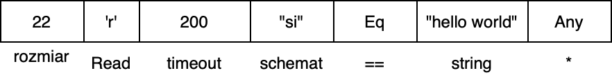

# UXP1A - LINDA - Dokumentacja końcowa

## Skład zespołu
* Świrta Bartosz - lider
* Wojno Maciej
* Górniak Daniel
* Zieliński Jakub

Data przekazania dokumentacji wstępnej: dd.mm.rrrr

## Temat projektu
<p align="justify">
Napisać wieloprocesorowy system realizujący komunikację w języku komunikacyjnym Linda. W uproszczeniu Linda realizuje trzy operacje:
</p> 

* output(krotka)
* input(wzorzec-krotki, timeout)
* read(wzorzec-krotki, timeout)

<p align="justify">
Komunikacja   międzyprocesowa   w   Lindzie   realizowana   jest   poprzez   wspólną   dla   wszystkich   procesów przestrzeń krotek. 
Krotki są arbitralnymi tablicami dowolnej długości składającymi się z elementów 3 typów podstawowych: string, integer, float. 
Przykłady krotek: 
</p>

* (1, ”abc”, 3.1415, ”d”)
* (10, ”abc”, 3.1415) 
* (2,3,1, „Ala ma kota”) 

<p align="justify">
Funkcja output umieszcza krotkę w przestrzeni. Funkcja input pobiera i atomowo usuwa krotkę z przestrzeni, przy czym wybór krotki następuje poprzez dopasowanie wzorca-krotki. Wzorzec jest krotką, w której dowolne składniki mogą być niewyspecyfikowane: * (podany jest tylko typ) lub zadane warunkiem logicznym. Przyjąć warunki: ==, <, <=, > , >= . Przykład: 
</p>

* input(integer:1, string:* , float:* ,string:”d”) – pobierze pierwszą krotkę z przykładu
* input (integer:>0, string:”abc”, float:*) - pobierze drugą krotkę z przykładu

<p align="justify">
Operacja read działa tak samo jak input, lecz nie usuwa krotki z przestrzeni. Operacje read i input zawsze zwracają jedną krotkę (choć pasować może więcej niż jedna). W przypadku gdy wyspecyfikowana krotka nie istnieje operacje read i input zawieszają się do czasu pojawienia się oczekiwanej danej.
</p> 

## Wariant zadania
Realizacja przestrzeni krotek ma zostać wykonana z użyciem potoków nienazwanych z centralnym procesem koordynującym (rodzicem).

## Interpretacja treści i przyjęte założenia
<p align="justify">
Proponowane rozwiązanie to biblioteka pozwalającą na uruchomienie wielu procesów potomnych, działających pod jednym procesem rodzica. Procesy potomne mogą komunikować się ze sobą za pomocą przestrzeni krotek, która jest koordynowana przez proces rodzica. Procesy potomne wykonują operacje zdefiniowane w języku Linda komunikując się z procesem rodzica poprzez potoki nienazwane. Proces rodzica tworzy i ustawia nienazwane potoki do komunikacji przy tworzeniu procesów potomnych. Oznacza to, że proces rodzica po wykonaniu operacji inicjalizacyjnych stanie się serwerem, a procesy potomne klientami.
</p> 

Przyjmujemy następujące założenia:

* Nie zakładamy maksymalnego rozmiaru krotki, jest on ograniczony jedynie przez docelowy system.
* Funkcje, które użytkownik przekazuje do uruchomienia jako pierwsze w procesach potomnych muszą być odpowiedniej postaci:
  patrz [Wymagania funkcji użytkownika](#wymagania-funkcji-użytkownika)

## Opis funkcjonalny
### Ujęcie ogólne
Użytkownikowi biblioteki udostępnione są poniższe funkcjonalności:

* utworzenie instancji obiektu, który realizuje przestrzeń krotek i koordynuje wieloprocesowy dostęp do tej przestrzeni
* uruchomienie systemu komunikacji
* dokonywanie operacji zdefiniowanych przez język Linda:
    * atomowe wstawienie krotki do przestrzeni
    * atomowe odczytanie krotki z przestrzeni
    * atomowe odczytanie i usunięcie krotki z przestrzeni

### linda::Server
<p align="justify">
Biblioteka udostępnia programiście klasę <b><i>linda::Server</i></b>, która to realizuje wieloprocesową komunikację. Posiada wewnętrznie instancję przestrzeni krotek i podczas konstrukcji przyjmuje wskazania na funkcje, które zostaną uruchomione jako osobne procesy.
W momencie uruchomienia komunikacji, nastąpi utworzenie procesów potomnych, a następnie proces wywołujący przejdzie w tryb pracy serwera. Korzystając z funkcji <a href="https://man7.org/linux/man-pages/man2/poll.2.html">poll(2)</a>, serwer oczekuje na komunikaty od procesów potomnych i realizuje ich żądania w przestrzeni krotek. 
Klasa udostępnia tylko jedną publiczną metodę:
</p> 

* ```void start()```

<p align="justify">
Metoda ta uruchamia system komunikacyjny. Użytkownik biblioteki może jedynie utworzyć instancję serwera i ją uruchomić.
</p>

### linda::Handle
<p align="justify">
Uchwyt do przestrzeni krotek, implementowany przez klasę, która opakowuje komunikację z procesem koordynującym przy użyciu potoków nienazwanych. Obiekt tej klasy zostanie utworzony
przez <b><i>linda::Server</i></b> i przekazany procesowi potomnemu. Klasa udostępnia trzy metody implementujące instrukcje języka Linda:
</p>

* ```std::optional<Tuple> read(TuplePattern &pattern, int timeout_ms = 0)```
* ```std::optional<Tuple> in(TuplePattern &pattern, int timeout_ms = 0)```
* ```void                 out(Tuple &tuple)```

### Wymagania funkcji użytkownika
Jedyne ograniczenie dotyczy postaci funkcji, które są przekazywane podczas kosntrukcji obiektu <b><i>linda::Server</i></b>:
```
void function(linda::Handle handle) {
    ...
}
```

### Struktury

#### Żądanie\


- rozmiar - rozmiar reszty wiadomości: `int`
- typ - rodzaj żądania: `enum RequestType: char { Read, In, Out }`
- timeout - wartość timeoutu: `int` (dla `Out` ignorowane ponieważ nie czeka na odpowiedź)
- dla `In` oraz `Read` wzorzec krotki: `TuplePattern`, dla `Out` krotka: `Tuple`

#### Odpowiedź\


- rozmiar - rozmiar reszty wiadomości: `int`
- typ - rodzaj odpowiedzi: `enum ResponseType: char { Result, Timeout }`
- dla `Result` dodatkowo krotka: `Tuple`

#### Krotka (Tuple)\


- schemat - schemat krotki zakodowany w stringu znakami `'s'`, `'i'` oraz `'f'` (n.p. `"fsii"` oznacza krotkę `(float, string, int, int)`)
- wartości - wartości krotki w tej samej kolejności co w schemacie

#### Wzorzec krotki (TuplePattern)\


- schemat - schemat krotki zakodowany tak samo jak w krotce
- wzory - wzorce wartości w tej samej kolejności co w schemacie

Wzorce wartości posiadają dwie postacie:

- `Any`
- `{ Eq, Less, LessEq, More, MoreEq }` + wartość

#### Przykład żądania Out\


- rozmiar reszty wiadomości = `1 + 4 + 5 + (4 + 4 + 12 + 4)` = `34`
- rodzaj żądania = `Out` = `'o'`
- timeout = `200ms`
- schemat krotki = `(int, float, string, int)`
- wartości krotki = `(15, 7.0, "hello world", 115)`

#### Przykład żądania Read\


- rozmiar reszty wiadomości = `1 + 4 + 3 + 1 + 12 + 1` = `22`
- rodzaj żądania = `Read` = `'r'`
- timeout = `200`
- schemat krotki = `(string, int)`
- wzorce krotki = `(== "hello world", *)`

#### Przykład odpowiedz Result\


- rozmiar reszty wiadomości = `1 + 4 + 4 + 12 + 4` = `25`
- rodzaj odpowiedzi = `Result` = `r`
- schemat krotki = `(int, string, float)`
- wartości krotki = `(-3, "hello world", 0.34)`

#### Przykład odpowiedzi Timeout\


- rozmiar reszty wiadomości
- rodzaj odpowiedzi = `Timeout` = `'t'`

## Analiza rozwiązania
Poniżej przedstawiamy analizę istonych naszym zdaniem kwiestii proponowanego rozwiązania.

### Realizacja przestrzeni krotek

<p align="justify">
Kontener przechowujący krotki został zrealizowany jako <a href="https://en.cppreference.com/w/cpp/container/unordered_map">std::unordered_map</a>. Pozwala to na optymalizację czasu przeszukiwania struktury w celu 
dopasowania wzorca. Kluczem w strukturze jest schemat krotki (string). Komunikacja z przestrzenią krotek przebiega z udziałem klasy 
<b><i>linda::Handle</i></b>, która opakowuje obsługę potoków udostępniając metody read, in oraz out. Dzięki temu metoda komunikacji 
miedzyprocesowej jest z punktu widzenia użytkownika biblioteki przezroczysta.
</p>

<p align="justify">
Podczas tworzenia obiektu klasy <b><i>linda::Server</i></b>, tworzy on dla każdego klienta odpowiednie potoki nienazwane przez które 
będzie się z nimi komunikował. Następnie za pomocą funkcji <a href="https://man7.org/linux/man-pages/man2/fork.2.html">fork(2)</a> 
tworzy procesy potomne, którym przekazuje wcześniej przygotowane potoki. Po przygotowaniu wszystkich klientów obiekt 
<b><i>linda::Server</i></b> przechodzi w tryb serwera i jest gotowy na obsługę zapytań przychodzących od klientów.
</p>

### Przetwarzanie żądań przez linda::Server
<p align="justify">
Proces koordynujący po uruchomieniu procesów potomnych przechodzi w tryb pracy serwera. Tryb ten realizowany jest poprzez pętlę nieskończoną
, w której serwer oczekuje na wiadomości od klientów. By wyeliminować aktywne oczekiwanie korzystamy z funkcji <a href="https://man7.org/linux/man-pages/man2/poll.2.html">poll(2)</a>.
Gdy klient wyśle do serwera żądanie ten dokłada je do wewnętrznej kolejki FIFO i rozpoczyna obsługę. 
</p>

<p align="justify">
Obsługa przebiega w pętli, w każdym kroku sprawdzane jest, czy któreś z poprzednich żądań nie uległo przedawnieniu, jeżeli tak to odsyłany jest 
stosowny komunikat do oczekującego klienta (po więcej informacji patrz <a href="#obsluga-timeout'ow">obsługa timeout'ów</a>). Następnie serwer próbuje
wykonać jedno żądanie, iterując się po wewnętrznej kolejce. Wykonanie jednego żądania kończy krok pętli. Warunkiem zakończenia pętli obsługi jest 
niemożność wykonania żadnego z oczekujacych żądań. Jest to przypadek, w którym warunki żadnego z żądań nie zostały spełnione i serwer przechodzi w 
tryb oczekiwania na nowe żądania.
</p>

<p align="justify">
Rozwiązanie to zapewnia, że procesy nie zostaną zagłodzone - kolejność realizacji żądań ustalana jest na podstawie kolejności zgłoszeń. 
Dodatkowo eliminujemy aktywne oczekiwanie i optymalizujemy działanie timeout'ów, o czym szerzej w kolejnej sekcji.
</p>

<a id="obsluga-timeout'ow">
</a>

### Obsługa timeout'ów
<p align="justify">
Timeout realizowany jest przez serwer, przez wysłanie do klienta odpowiedzi, że nie zdążył on na czas zrealizować żądanie. Timeout 
podawany jest w milisekundach i jest on synchronizowany do serwera - tzn. timeout liczony jest od czasu zarejestrowania przez serwer 
żądania klienta. Oznacza to, że z punktu widzenia użytkownika próba wykonania operacji może zablokować proces na dłużej niż podana 
wartość, ale gwarantuje poprawną synchronizację żądań.
</p>

<p align="justify">
W celu zapewnienia możliwie małej niedokładności, przed każdą próbą wykonania kolejnego żądania sprawdzane jest które żądania się przedawiniły i do nich priorytetowo wysyłany jest komunikat o przedawnieniu żądania.
</p>

<p align="justify">
Uważamy, że takie podjście jest odpowiednie, gdyż gwarantujemy poprawność synchronizacji i tym samym nie dojdzie do sytuacji w której 
klient odblokował się po timeout'cie, ale serwer zaczął już wykonywać operację input - efektywnie błędnie usuwająć krotkę z przestrzeni. 
Jedynym sposobem na zapewnienie poprawnego działania systemu jest poprawna synchronizacja klienta z serwerem, która w tej sytuacji 
wymusza, żeby to serwer informował klienta o tym, że żądanie się przedawniło i żądana operacja nie zostanie wykonana. Biorąc pod uwagę, że 
systomowe funkcje takie jak  <a href="https://man7.org/linux/man-pages/man2/nanosleep.2.html">nanosleep(2)</a> również nie gwarantują 
pełnej dokładności czasowej, uważamy brak takiej gwarancji w naszej bibliotece za dopuszczalny. 
</p>

## Podział na moduły
* LindaServer - realizuje koordynatora przestrzeni krotek. Tworzy przestrzeń krotek i uruchamia procesy, które chcą z niej korzystać. Implementuje serwer obsługujący żądania wykonywania operacji języka Linda wysyłane przez utworzone procesy.
* LindaHandle - realizuje obiekt dostępowy do przestrzeni krotek. Obiekt ten posiada interfejs języka Linda i jest wykorzystywany przez procesy korzystające z przestrzeni krotek. Implementuje operacje języka Linda przez wysyłanie żądań do koordynatora przestrzeni krotek.
* LindaTuple - zawiera implementacje struktur reprezentujących krotki i wzorce krotek, oraz operacje pozwalające na serializację i deserializację ich.
* LindaTupleSpace - realizuje przestrzeń krotek. Posiada metody modyfikujące przestrzeń odpowiadające operacjom języka Linda.
* Moduł testowy - zawiera testy jednostkowe i przykładowe programy korzystające z biblioteki.

## Struktura komunikacji między modułami\


## Planowane testy
Poprawność systemu planujemy testować za pomocą testów zautomatyzowanych podzielonych na dwie kategorie:

* testy jednostkowe modułów - mają zweryfikować, czy implementacja funkcjonalności oferowanych przez
poszczególne moduły przebiegła poprawnie
* testy akceptacyjne systemu - mają zweryfikować poprawne działanie całego systemu w różnych 
scenariuszach testowych. Scenariusze testowe będę realizowane przez zewnętrzne programy wykonujące 
sekwencję operacji w przestrzeni krotek.

## Szczegóły implementacji i używane biblioteki
Język implementacji: __C++17__  
Kompilator: __clang 13__  
Narzędzie budowania: __CMake__  
Formater kodu: __clang-format__ - format własny

Wykorzystane biblioteki: 

* GoogleTest - bibliotek testów jednostkowych
* CTest - runner testów jednostkowych
